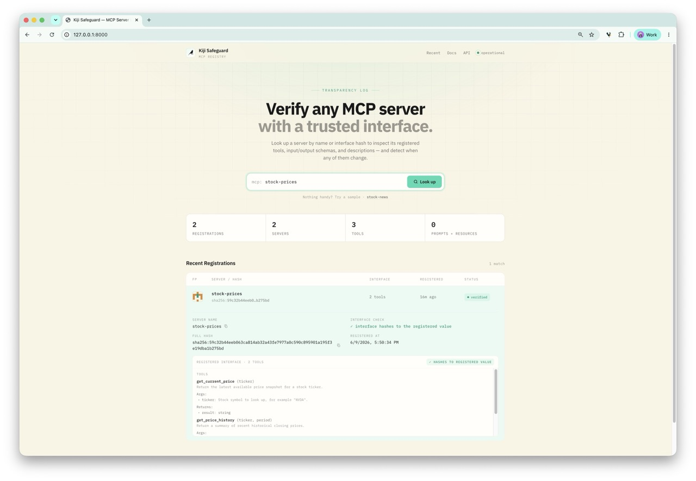

# kiji-safeguard

Sign and verify **MCP servers**. Detects when tools, schemas or descriptions
change.

`kiji-safeguard` is the MCP-server sibling of
[`agent-signing`](https://github.com/hanneshapke/agent-signing). The signature
of an MCP server is a **content hash of its public interface** — tool names,
descriptions and JSON schemas (plus prompts, resources and server
instructions). No keys, no user identity: a server is registered with a
**name**, its interface **hash** and the full **interface description**, and
verification recomputes the hash from the live server and looks it up in the
registry. The check runs on both ends: the server (or its CI) **publishes**
its intended interface, and the agent **verifies** it on every connection —
recomputed from what actually arrived over the wire, before any tool reaches
the model.

This catches the classic MCP supply-chain problems: a tool quietly added or
removed, a schema widened, or a description rewritten to poison the model
("rug pull" / tool-description injection).



*The registry's web UI (`GET /`): browse recent registrations, search by name or
hash, and inspect the registered interface of any MCP server.*

## The magic one-liner

Add a single import to any [FastMCP](https://github.com/modelcontextprotocol/python-sdk)
server — before *or* after `mcp` is imported:

```python
import kiji_safeguard.autosign  # noqa: F401
```

The same line plays two roles depending on where it sits: in the **server**
it publishes (registers) the intended interface and catches accidental drift;
in the **agent** it verifies that interface before any tool reaches the model
— the actual security check (see [Threat model](#threat-model-who-should-run-what)).

In the server: an import hook patches `FastMCP.run()` the moment
`mcp.server.fastmcp` is imported (or in place, if it already was). Every time
the server starts, its interface is extracted, hashed and checked against the
registry — with zero further code changes. The first run registers the server
(trust-on-first-use), every later run verifies it:

```text
$ python weather_server.py
[kiji-safeguard] first sight of 'weather' — registered with hash 4c469eb41474f6eb… at http://127.0.0.1:8000
$ python weather_server.py
[kiji-safeguard] verified 'weather' (hash 4c469eb41474f6eb…)
```

If someone edits a tool description after registration:

```text
[kiji-safeguard] WARNING: verification of 'weather' failed: interface changed:
'weather' is registered with hash 4c469eb4…, but the live interface hashes to 740e904b…
```

Behaviour is driven by environment variables, so the same code runs in every
stage of the lifecycle:

| Variable | Values | Default | Meaning |
| --- | --- | --- | --- |
| `KIJI_SAFEGUARD_MODE` | `auto` / `verify` / `register` / `off` | `auto` | `auto` verifies and registers unknown servers on first sight (a *changed* interface is only flagged, never re-registered); `verify` never registers; `register` always publishes; `off` disables |
| `KIJI_SAFEGUARD_REGISTRY` | URL | `http://127.0.0.1:8000` | Registry base URL |
| `KIJI_SAFEGUARD_ENFORCE` | `1`/`true`/… | unset | Abort startup on failure instead of warning |

All diagnostics go to **stderr** — stdout stays clean for the stdio transport.

### The same line protects the agent

The import also works on the **client side**. Drop it into the process that
*connects to* MCP servers — directly via `mcp.ClientSession` or through an
adapter such as CrewAI's `MCPServerAdapter`:

```python
import kiji_safeguard.autosign  # noqa: F401
```

The hook detects which side it is on: importing `mcp.server.fastmcp` patches
`FastMCP.run()` (server side), importing `mcp.client.session` patches
`ClientSession.initialize()` (agent side) — both can coexist in one process.
On the agent side every connection's `initialize()` handshake is followed by
listing the server's tools, prompts and resources, rebuilding the interface
from the wire and checking it against the registry **before any tool reaches
the agent**:

```text
[kiji-safeguard] verified 'stock-prices' (hash 4c469eb41474f6eb…)
[kiji-safeguard] WARNING: verification of 'stock-news' failed: interface changed: …
```

The server is identified by the `serverInfo.name` it reports during the
handshake, and the wire-derived hash matches the one the server computes for
itself, so both sides verify against the same registry record. The same
environment variables apply; with `KIJI_SAFEGUARD_ENFORCE=1` a failed
verification aborts the connection (the adapter's context manager raises),
so the agent never sees the tools of a tampered server.

> Tools with structured output need `mcp >= 1.10` on both sides — older
> clients never receive the output schema on the wire, so their hash cannot
> match.

## Threat model: who should run what

The two sides of the import are not equally trustworthy, and it pays to be
explicit about which one protects you from what.

**Server-side verification is self-attestation.** The process doing the
check is the one you are worried about: a tampered or malicious server
simply removes the import, sets `KIJI_SAFEGUARD_MODE=off`, or strips the
environment variables — and even when the import survives, its warnings land
on a subprocess stderr that MCP adapters often swallow. Treat the
server-side hook as the **publishing half** (declaring the intended
interface to the registry, the way a publisher signs a release) plus
**honest-mistake drift detection**: a dependency upgrade that silently
changes a generated schema, or a dev edit that reaches prod, is flagged at
startup instead of when agents start failing.

**The agent-side check is the security boundary.** It runs in the process
the attacker does not control and hashes what actually arrived over the
wire, so a server cannot lie its way past it. Production agents should run
it strictly:

```bash
KIJI_SAFEGUARD_MODE=verify KIJI_SAFEGUARD_ENFORCE=1 python my_agent.py
```

Recommended deployment:

| Where | Mode | Why |
| --- | --- | --- |
| Server startup or CI release step | `register` | Publish the authoritative interface baseline |
| Development & demos | `auto` (default) | Trust-on-first-use; new interfaces are pinned automatically |
| Production agents | `verify` + `KIJI_SAFEGUARD_ENFORCE=1` | Strict check; a mismatch aborts the connection before any tool reaches the model |

**Known limitation.** The agent looks the server up by the
`serverInfo.name` the server reports about itself, so a tampered server can
*rename* itself — and in `auto` mode an unknown name is TOFU-registered and
trusted. `verify` mode with enforcement narrows this (an unregistered name
fails instead of being adopted), but the full fix — pinning the *expected*
name per configured server on the agent side — is future work.

## Quickstart

```bash
pip install "kiji-safeguard[server]"   # or: uv pip install -e ".[dev]" from this repo

# 1. Run the registry (FastAPI + SQLite, with a tiny web UI at /)
kiji-safeguard serve --port 8000

# 2. Register a server (loads the file, finds the FastMCP instance)
kiji-safeguard register mcp_servers/stock_price_server.py

# 3. Verify it any time — exits non-zero on mismatch
kiji-safeguard verify mcp_servers/stock_price_server.py
```

Or with the magic import instead of the CLI:

```bash
python my_server.py                            # first run registers, later runs verify
KIJI_SAFEGUARD_ENFORCE=1 python my_server.py   # production: refuse to start on mismatch
KIJI_SAFEGUARD_MODE=verify python my_server.py # strict: never auto-register
```

## Programmatic API

```python
from kiji_safeguard import MCPSigner

signer = MCPSigner.from_server(mcp)          # any FastMCP instance
signer.hash                                  # 64-char interface hash
signer.register("http://127.0.0.1:8000")     # POST name + hash + interface

result = signer.verify("http://127.0.0.1:8000")
if not result:
    raise RuntimeError(result.reason)
```

`extract_interface()` and `aggregate_hash()` are exposed too if you only want
the hashing.

## How the hash works

Following `agent-signing`, the hash is **order-independent**:

1. Every interface component (tool, prompt, resource, instructions) is
   serialised as canonical JSON (sorted keys, compact separators).
2. Each serialisation is hashed with SHA-256.
3. The per-component digests are sorted lexicographically, concatenated and
   hashed again.

Reordering tools never changes the hash; changing a name, description or any
schema detail always does. The server **name is not part of the hash** — it is
registry metadata, which lets verification distinguish "interface changed"
from "same interface registered under a different name".

## Registry API

| Method & path | Purpose |
| --- | --- |
| `POST /servers` | Register `{name, hash, interface}`. Rejects submissions whose hash doesn't match the interface (400). Idempotent per `(name, hash)`. |
| `GET /servers/{hash}` | All registrations for an interface hash (404 if none). |
| `GET /servers?name=&limit=&offset=` | Recent registrations, optionally filtered by name. |
| `GET /` | Web UI: browse, search by name or hash, and inspect registered interfaces. |

Storage is SQLite (`KIJI_SAFEGUARD_DB`, default `kiji_safeguard_registry.db`).

## Repository layout

```
kiji_safeguard/        # client library (stdlib-only, no dependencies)
├── signer.py          # interface extraction, hashing, register/verify
├── autosign.py        # the magic import hook
└── cli.py             # hash / register / verify / serve
server/                # registry service (mirrors agent-signing's layout)
├── backend/
│   ├── main.py        # FastAPI endpoints
│   ├── models.py      # pydantic models
│   └── database.py    # SQLite persistence
└── frontend/
    └── index.html     # web UI (shares agent-signing's registry design)
examples/              # demo project whose MCP servers use the magic import
tests/                 # pytest suite (incl. live-registry round trips)
```

The client library is intentionally **dependency-free** (stdlib `urllib` +
`hashlib`), so adding the safeguard import to an MCP server or agent pulls in
nothing else. (The agent-side hook uses `anyio` for its thread offload, but
only ever runs where `mcp` — which depends on `anyio` — is already
installed.) The registry extras (`fastapi`, `uvicorn`) are only needed where
the registry runs.

## Development

```bash
uv venv && uv pip install -e ".[dev]"
pytest
```
